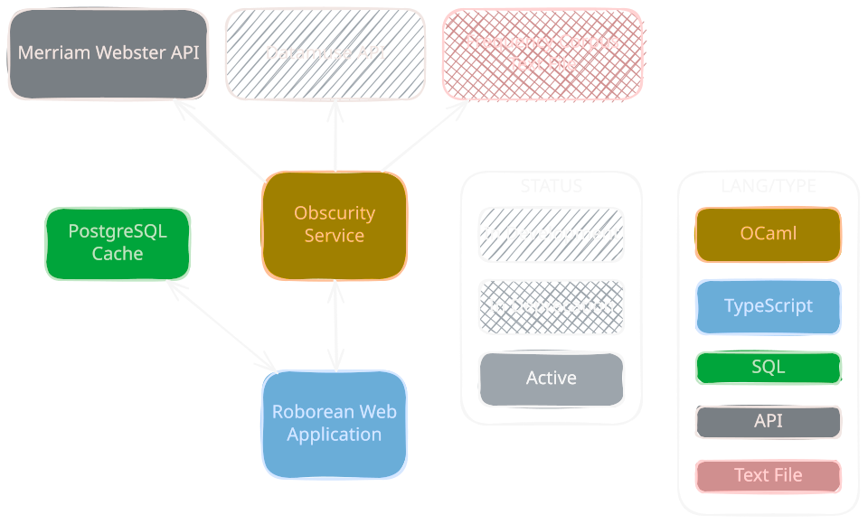

# ROBOREAN
>strong and sturdy; like an oak tree.

A simple word scoring application.


# STARTUP INSTRUCTIONS

**Prerequisites**

- Docker Engine with Compose v2 (check with `docker compose version`)
- A free **Merriam-Webster Collegiate Dictionary** API key from [dictionaryapi.com](https://dictionaryapi.com/register/index)
- Port 3000 free on host

You do _not_ need Node, OCaml, or opam installed. Everything builds inside containers.

**Setup**

```bash
git clone https://github.com/carsonmagnuson/roborean.git
cd roborean

cp .env.example .env
```

Open `.env` and fill in both values:

```
MW_API_KEY=your-collegiate-dictionary-key
POSTGRES_PASSWORD=any-password-you-like
```

The `.env` file must sit in the repository root, next to `compose.yaml`. Compose reads it automatically and will refuse to start if either variable is missing.

**Start**

```bash
docker compose up --build
```

Then open <http://localhost:3000>.

First build can take a while (5–10 minutes) as the obscurity service compiles the OCaml toolchain and its dependencies from source. Subsequent builds are cached so should be faster.


**Verify**

```bash
docker compose ps
docker compose exec -T app wget -qO- http://obscurity:8080/score/hello
docker compose exec -T app wget -qO- http://obscurity:8080/define/hello
```

The obscurity service is not published to the host and is reachable only from inside the Compose network, which is why these run through the `app` container.

**Stop**

```bash
docker compose down      # keep database
```

or

```bash
docker compose down -v   # delete Postgres volume
```

**Troubleshooting**

| Symptom | Cause |
| --- | --- |
| `required variable POSTGRES_PASSWORD is missing` | No `.env`, or it isn't in the repo root |
| `Failure("No API Key")` in the obscurity logs | `MW_API_KEY` unset in `.env` |
| Scores work, definitions return errors | Wrong Merriam-Webster product — keys are issued per API, and this needs the Collegiate Dictionary |
| `port is already allocated` | Something else is on 3000; change the host side of the port mapping in `compose.yaml` |

Logs for a single service: `docker compose logs obscurity`

# CURRENT ARCHITECTURE

>Plans to deprecate local frequency corpus in favor of cached frequency scores from soon-to-be-added Datamuse API.


